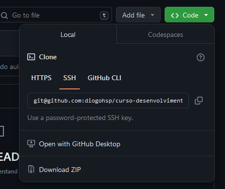
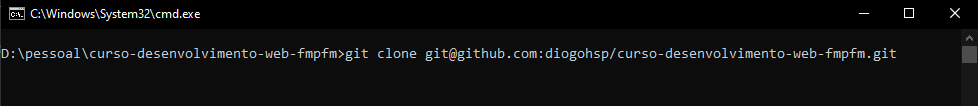
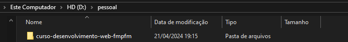

# Eai👋

  

  Segue abaixo o passo a passo para você clonar esse repositorio 👇
  

## 1º Passo ❕

   

      Com o GIT instalado em seu computador você irá clicar em "code" e copiar uma das opções "HTTPS" ou "SSH"
   

   
   
## 2º Passo ❕

   

      Com a opção copiada você irá até sua pasta onde você pretende salvar o arquivo. Já dentro da pasta abra seu terminal e rode o seguinte comando:

      git clone "aqui será inserido a opção que você copiou"

   

   

## Concluído ✅

 

      Feito isso o repositório já deve estar na sua pasta e pronto para ser usado!

# curso-desenvolvimento-web-fmpfm-
